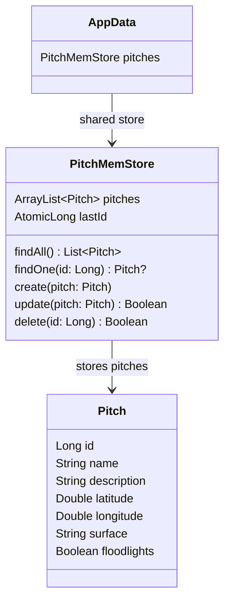

# FiveASideFinder UML Class Diagram

```mermaid
classDiagram
    %% Show the pitch data and its shared memory store.
    class Pitch {
        Long id
        String name
        String description
        Double latitude
        Double longitude
        String surface
        Boolean floodlights
    }

    class PitchMemStore {
        ArrayList~Pitch~ pitches
        AtomicLong lastId
        findAll() List~Pitch~
        findOne(id: Long) Pitch?
        create(pitch: Pitch)
        update(pitch: Pitch) Boolean
        delete(id: Long) Boolean
    }

    class AppData {
        PitchMemStore pitches
    }

    AppData --> PitchMemStore : shared store
    PitchMemStore --> Pitch : stores pitches
```
